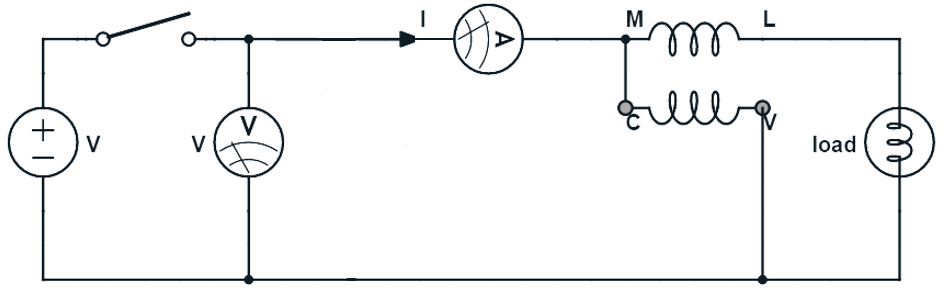

### Introduction  
The power factor (PF) of an AC electrical power system is defined as the ratio of working power (measured in kilowatts, kW) absorbed by the load to the apparent power (measured in kilovolt amperes, kVA) flowing through the circuit. Power factor is a dimensionless number in the closed interval of −1 to 1.  

The “ideal” power factor is one (also referred to as “unity”). This is when there is no reactive power through the circuit, and hence apparent power (kVA) is equal to real power (kW). A load with a power factor of 1 is the most efficient loading of the supply.  

Power factor is an important parameter of a system and improving power factor is much essential for economical and better performance of the system. Since most of the device in real life are inductive and lagging device. If the power factor of a system for a given power requirement is poor, then large value of Volt- Ampere or the large amount of current required by the system which is drawn from the supply.    

<!--    
    -->

 
Fig.1: Circuit Diagram for measurement of power factor
  

Fluorescent lamps form and inductive load on the AC mains supply. As a result large installations of such lamps suffer a poor power factor and resultant voltage drop. Adding a capacitor in parallel to each lamp corrects the power factor bringing it back to close to unity.In AC circuits, there are two kind of electric power supplying the load: one is active power P, the other Q is reactive power Q.  

Real power (P) also known as true or active power, performs the “real work” within an electrical circuit. Real power measured in watts, defines the power consumed by the resistive part of a circuit. Then real power (P) in an AC circuit is the same as power, P in a DC circuit. 

As resistances do not produce any phasor difference (phase shift) between voltage and current waveforms, all the useful power is delivered directly to the resistance and converted to heat, light and work. Then the power consumed by a resistance is real power which is fundamentally the circuits average power. 

Calculating the average power of AC should take the phase difference of voltage and current i.e. Ф  

$$P= VIcosФ $$ 

$$cosФ =\frac {P}{V⋅I}.........(1) $$               

The cosФ mentioned the formula is the power factor of the circuit. The phase difference of voltage and current or the power factor of the circuit is dependent on the circuit (load) parameters.  

Reactive power (Q) also known as wattless power is the power consumed in an AC circuit that does not perform any useful work but has a big effect on the phase shift between the voltage and current waveforms.Unlike active power (P) which does all the work, reactive power (Q) takes power away from a circuit due to the creation and reduction of both inductive magnetic fields and capacitive electrostatic fields, thereby making it harder for the true power to supply power directly to a circuit or load. 

To find reactive power, the rms voltage and current values are multiplied by the sine of the phase angle, Φ as shown below:

$$Q = VIsinФ VAr....... (2)  $$ 

The product of the rms voltage V applied to an AC circuit and the rms current I flowing into that circuit is called the “volt-ampere product” (VA) given the symbol S and whose magnitude is known generally as apparent power. Apparent power,   

$$S=V ⋅ I = \sqrt{(P^2 + Q^2)}.......(3)$$

In electrostatics, power factor could also indicate the utilization rate of the alternating current (AC). Power factor defined as the ratio of active power P and apparent power S,  

$$cosФ = \frac{P}{S}  ..........(4) $$ 

Fluorescent lamp is inductive load and commonly used methods for improving the power factor is to the perceptual load, the common way to improve power factor is to parallelly connect the inductive load and electrostatic capacitance.  

The electric current and the power factor of inductive load would not change after parallelly connecting the capacitor because the applied voltage and load parameter hasn’t been changed while the phase difference Ф of the voltage V and electric current has became declined, that is cosФ rising. Here the factor of improving the power mentioned is the factor of improving the power supply or the power grid, rather than any inductive load power factor.   

### Advantages of Power Factor: 

1. Increase in the efficiency of system and devices 

2. Low voltage drop 

3. Saving in the electricity bill

4. Better usage of power system, lines and generators etc.

5. Reduced Line losses

 ### Disadvantages of Power Factor: 

1. Since capacitors have short service life therefore, they need more maintenance.

2. They are easily damaged if the voltage exceeds the rated value.

3. Once the capacitors are damaged, their repair is uneconomical.

